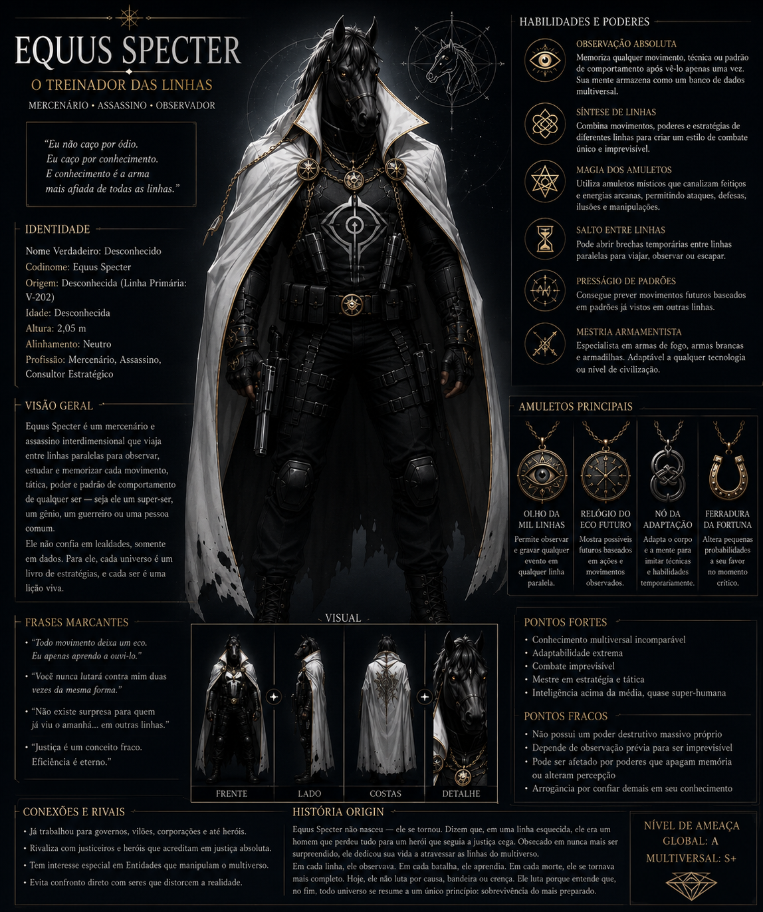

# Equinox — O Carcereiro das Linhas

## Visão Geral
**Nome Verdadeiro:** Asterion (sobrenome perdido ao tempo)
**Codinome:** Equinox
**Títulos:** O Cavalo Negro, O Carcereiro das Linhas, O Juiz das Possibilidades, O Colecionador de Destinos, O Último Cavaleiro, O Executor do Grande Desenho, O Homem da Capa Branca, O Arauto do Véu
**Alinhamento Moral:** Anti-Vilão (Guardião do Equilíbrio)
**Espécie:** Humano (Transformado por Ritual Temporal)
**Sexo:** Masculino
**Idade:** Desconhecida (estima-se milhares de anos)
**Altura:** 1,94 m
**Peso:** 96 kg
**Afiliação:** Antiga Ordem dos Cartógrafos Eternos (Ex-membro), Agente de Aion, Guardião da Integridade Temporal
**Origem:** Desconhecida (Linha Primária: V-202)
**Profissão:** Mercenário, Assassino, Consultor Estratégico, Executor do Grande Desenho

Equinox é o executor silencioso das decisões mais difíceis do multiverso. Transformado por um ritual ancestral que lhe deu a cabeça de um cavalo negro e olhos dourados luminosos, ele caminha entre linhas temporais paralelas observando, estudando e julgando cada movimento de qualquer ser. Sua silhueta tornou-se um símbolo da morte: existe um ditado em Vertigma que diz — *"Quando o Cavalo Negro atravessa a porta... alguém deixará de existir naquele destino."*

---
## Índice de Arquivos
| Arquivo | Descrição |
|---------|-----------|
| [Aparência.md](Aparência.md) | Descrição visual completa |
| [Personalidade.md](Personalidade.md) | Perfil psicológico e emocional |
| [História.md](História.md) | Biografia completa com linha do tempo |
| [Poderes e Habilidades.md](Poderes%20e%20Habilidades.md) | Poderes, fraquezas e custos |
| [Relações.md](Relações.md) | Mapa de relacionamentos e vínculos |
| [Curiosidades.md](Curiosidades.md) | Detalhes ocultos e trivia |
| [Citações.md](Citações.md) | Frases marcantes do personagem |
| [Potencial Narrativo.md](Potencial%20Narrativo.md) | Arcos de história e evolução |

---
## Conexões com a Lore
Equinox é o principal agente de Aion (O Guardião do Fluxo) e opera nas sombras do multiverso Vertigma:
- **Aion (O Guardião do Fluxo):** Seu mentor e guia. Aion envia sinais sutis que Equinox interpreta e age conforme sua própria decisão. Equinox é o único ser em quem Aion confia plenamente.
- **Cebryn Aster:** Uma entidade que coleciona destinos e que Aion protege os caminhos. Equinox trabalha nas interseções entre os dois, sendo o executor físico das decisões do Grande Desenho.
- **CDT (Central do Tempo):** Equinox opera acima da jurisdição da CDT. Se agentes da CDT ameaçarem o Grande Desenho, Equinox será enviado para corrigir a situação.
- **Réplico (O Reflexo Sombrio):** Uma ameaça artificial que caça heróis e vilões por "equilíbrio". Equinox poderia julgar Réplico como uma anomalia que ameaça a Integridade Temporal.
- **Ícaro Vellum (Reflexo Negro):** Um anti-vilão com poderes reflexivos dimensionais. Equinox o observa como uma variável potencial no Grande Desenho.
